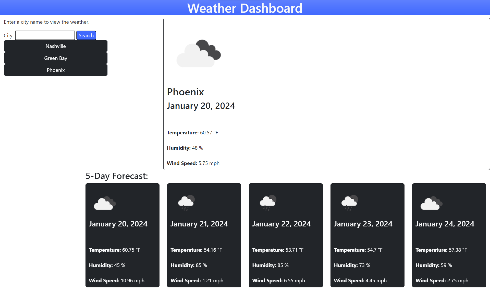

# Code Quiz

Visit the [Weather Dashboard](https://kdelaria.github.io/weather-dashboard/) webpage.

## Description

 This webpage was designed to inform the user of weather conditions for a city.

## Installation

N/A

## Usage

Enter a city name to get the current forecast along with the 5 day outlook.

## Credits

*"How to Use API Keys" Full-Stack Blog, *[coding-boot-camp.github.io/full-stack/apis/how-to-use-api-keys](https://coding-boot-camp.github.io/full-stack/apis/how-to-use-api-keys)*. Accessed 8 Jan. 2024.*

*"Current Weather Data" Open Weather, *[openweathermap.org/current#name](https://openweathermap.org/current#name)*. Accessed 8 Jan. 2024.*

*"5 Day Weather Forecast" Open Weather, *[openweathermap.org/forecast5](https://openweathermap.org/forecast5)*. Accessed 8 Jan. 2024.*

*"Weather Conditions" Open Weather, *[openweathermap.org/weather-conditions](https://openweathermap.org/weather-conditions)*. Accessed 8 Jan. 2024.*

*"Add Day.js" Day.js, *[day.js.org/docs/en/manipulate/add](https://day.js.org/docs/en/manipulate/add)*. Accessed 9 Jan. 2024.*

## License
N/A